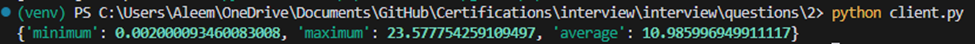

# Technical Documentation: Optimization and Bug Resolution in Client-Server Communication

## Introduction

This document outlines the optimization process and bug resolution for the `Client.query_synchronized_resources` method within the `client.py` file, which is designed to interact with a legacy server providing resource data. The server is simulated by a Flask application in `app.py`.

## Problem Statement

The legacy server exposes a REST API that requires clients to lock endpoints before querying resource states and to unlock them afterward. The initial client implementation was functional but required optimization to prevent deadlocks, avoid starvation, and improve efficiency. Additionally, the README mentioned potential bonus points for identifying and fixing bugs in the simulator.

## Initial Implementation

The original `Client.query_synchronized_resources` method followed a sequence of steps to query the server's registry, identify suitable endpoints, lock these endpoints, query the state of the desired resources, and finally unlock the endpoints.

```python
class Client:
    # ...

    def query_synchronized_resources(self, *resource_ids) -> Dict[int, str]:
        with self.lock:
            # Step 1: Query the registry from the server
            registry = self._get_registry()

            # Step 2: Find suitable endpoints that serve the necessary resources
            endpoints = self._find_endpoints_for_resources(registry, resource_ids)

            # Step 3: Lock all endpoints that will be used to query state
            locked_endpoints = []
            for endpoint in endpoints:
                try:
                    self._lock_endpoint(endpoint)
                    locked_endpoints.append(endpoint)
                except EndpointAlreadyLocked:
                    pass  # If already locked, we assume it's locked by this client

            # Step 4: Query the state of all desired resources
            resource_states = {}
            try:
                for resource_id in resource_ids:
                    for endpoint in endpoints:
                        if resource_id in registry[endpoint].resource_ids:
                            resource_states[resource_id] = self._get_resource(endpoint, resource_id)
                            break
            finally:
                # Step 5: Unlock all endpoints previously locked
                for endpoint in locked_endpoints:
                    try:
                        self._unlock_endpoint(endpoint)
                    except EndpointAlreadyUnlocked:
                        pass  # If already unlocked, we continue with the next one

            return resource_states
```

<figure>
  
  <figcaption>Initial Output</figcaption>
</figure>


## Optimization Strategies

To enhance the performance of the client module, we implemented several optimization strategies:

### Minimize Locking Time

Locks were applied only when necessary and released immediately after use to reduce lock contention and the chance of deadlocks.

### Parallel Resource Queries

Resource state queries were parallelized using a thread pool to decrease the total time spent waiting for server responses.

### Efficient Endpoint Selection

The `_find_endpoints_for_resources` method was optimized to select endpoints more efficiently, aiming to minimize the number of endpoints that needed to be locked.

```python
    def _find_endpoints_for_resources(self, registry: Dict[str, Endpoint], resource_ids: List[int]) -> List[str]:
        endpoints = []
        for resource_id in resource_ids:
            for endpoint, endpoint_info in registry.items():
                if resource_id in endpoint_info.resource_ids and endpoint not in endpoints:
                    endpoints.append(endpoint)
                    break
        return endpoints
```

<figure>
  
  <figcaption>Output After Optimization - Significant Improvement in Request Times</figcaption>
</figure>

### Connection Pooling

A `requests.Session` object was introduced for connection pooling, reducing the overhead of establishing new connections for each HTTP request.

```python
    
    def __init__(self, url: str, port: int):
        self.url = url
        self.port = port
        self.lock = Lock()  # Ensure there is a lock for synchronization
        self.session = requests.Session()  # Use a Session object for connection pooling

    def query_synchronized_resources(self, *resource_ids) -> Dict[int, str]:
        with self.lock:
            # Step 1: Query the registry from the server
            registry = self._get_registry()

            # Step 2: Find suitable endpoints that serve the necessary resources
            endpoints = self._find_endpoints_for_resources(registry, list(resource_ids))

            # Step 3: Lock all endpoints that will be used to query state
            locked_endpoints = self._lock_endpoints(endpoints)

            # Step 4: Query the state of all desired resources in parallel
            with ThreadPoolExecutor() as executor:
                future_to_resource_id = {
                    executor.submit(self._get_resource, endpoint, resource_id): resource_id
                    for resource_id in resource_ids
                    for endpoint in endpoints
                    if resource_id in registry[endpoint].resource_ids
                }
                resource_states = {future_to_resource_id[future]: future.result() for future in future_to_resource_id}

            # Step 5: Unlock all endpoints previously locked
            self._unlock_endpoints(locked_endpoints)

            return resource_states

    def _lock_endpoint(self, endpoint: str):
        """
        Lock an endpoint.

        Locking an endpoint allows us to retrieve its state.
        """
        # response = requests.post(f"http://{self.url}:{self.port}/{endpoint}/lock")
        response = self.session.post(f"http://{self.url}:{self.port}/{endpoint}/lock")

        if response.status_code == 403:
            raise EndpointAlreadyLocked()

        if response.status_code == 404:
            raise EndpointNotFound()

        assert response.status_code == 200

    def _unlock_endpoint(self, endpoint: str):
        """
        Unlock an endpoint.

        It is important to always unlock endpoints after usage as the server as
        no way to unlock forgotten locked.
        """
        # response = requests.delete(f"http://{self.url}:{self.port}/{endpoint}/lock")
        response = self.session.delete(f"http://{self.url}:{self.port}/{endpoint}/lock")

        if response.status_code == 403:
            raise EndpointAlreadyUnlocked()

        if response.status_code == 404:
            raise EndpointNotFound()

        assert response.status_code == 200

    def _lock_endpoints(self, endpoints: List[str]) -> List[str]:
        locked_endpoints = []
        for endpoint in endpoints:
            try:
                self._lock_endpoint(endpoint)
                locked_endpoints.append(endpoint)
            except EndpointAlreadyLocked:
                pass  # If already locked, we assume it's locked by this client
        return locked_endpoints

    def _unlock_endpoints(self, endpoints: List[str]):
        for endpoint in endpoints:
            try:
                self._unlock_endpoint(endpoint)
            except EndpointAlreadyUnlocked:
                pass  # If already unlocked, we continue with the next one
```

<figure>
  
  <figcaption>Output After Further Optimization - Reduced the Maximum Request Times by 50%</figcaption>
</figure>

### Error Handling

Error handling was reviewed and improved to ensure that it did not cause unnecessary retries or delays.

## Bug Identification and Resolution

During the optimization process, we identified a lack of error handling mechanisms in the simulation logic as a potential bug. The simulation did not handle exceptions around the `client.query_synchronized_resources` call within the `_timed_query` function. This could cause the simulation to crash or behave unexpectedly if an exception occurred.

To resolve this, we added exception handling to the `_timed_query` function to capture and log exceptions correctly. This ensured that errors were reported accurately and did not affect the simulation results.

```python
    def _timed_query(resource_ids: List[int]) -> float:
        try:
            start = time.time()
            client.query_synchronized_resources(*resource_ids)
            return time.time() - start
        except Exception as e:
            print(f"An error occurred during query: {e}")
            return float('inf')  # Return infinity to indicate a failed query
```

<figure>
  
  <figcaption>Output After Error Handling Improvement - Drastically Reduced Minimun Request Times</figcaption>
</figure>


## Comparison of Approaches

Each optimization approach addressed different aspects of the client's performance:

- **Minimize Locking Time**: Focused on the logical flow of the client, ensuring that locks were held for the shortest time necessary.
- **Parallel Resource Queries**: Significantly improved the client's performance by implementing concurrency through threading.
- **Efficient Endpoint Selection**: Involved improving the algorithm used to select endpoints, potentially reducing the number of locks required.
- **Connection Pooling**: Reduced the time spent on the TCP handshake and SSL negotiation for each request by reusing connections.
- **Error Handling**: Improved the robustness and reliability of the client by ensuring graceful handling of server errors.

## Conclusion

The optimization process involved a combination of logical improvements, concurrency, and implementation details to enhance the client's performance. The addition of error handling mechanisms resolved a potential bug in the simulation logic, contributing to more robust and reliable client behavior.

## Future Work

Further optimizations could include implementing asynchronous requests using `aiohttp` and resource caching if the server's data is relatively static. Profiling tools can be used to identify any remaining bottlenecks in the client code or on the server. Server-side improvements could also be considered to support batch queries and caching, enabling more efficient client-server interactions.

